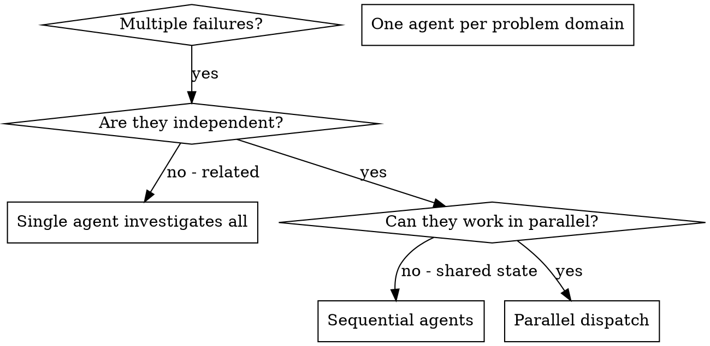

# Dispatching Parallel Agents

**Source:** OpenClaw → AiDarr GOTCHA Conversion
**Original:** dispatching-parallel-agents/SKILL.md
**Converted:** 2026-02-11

---

## Description

Use when facing 2+ independent tasks that can be worked on without shared state or sequential dependencies

---

## Goals (Objectives)


# Dispatching Parallel Agents

## Overview

When you have multiple unrelated failures (different test files, different subsystems, different bugs), investigating them sequentially wastes time. Each investigation is independent and can happen in parallel.

**Core principle:** Dispatch one agent per independent problem domain. Let them work concurrently.

## When to Use



**Use when:**
- 3+ test files failing with different root causes
- Multiple subsystems broken independently
- Each problem can be understood without context from others
- No shared state between investigations

**Don't use when:**
- Failures are related (fix one might fix others)
- Need to understand full system state
- Agents would interfere with each other

## The Pattern

### 1. Identify Independent Domains

Group failures by what's broken:
- File A tests: Tool approval flow
- File B tests: Batch completion behavior
- File C tests: Abort functionality

Each domain is independent - fixing tool approval doesn't affect abort tests.

### 2. Create Focused Agent Tasks

Each agent gets:
- **Specific scope:** One test file or subsystem
- **Clear goal:** Make these tests pass
- **Constraints:** Don't change other code
- **Expected output:** Summary of what you found and fixed

### 3. Dispatch in Parallel

```typescript
// In Claude Code / AI environment
Task("Fix agent-tool-abort.test.ts failures")
Task("Fix batch-completion-behavior.test.ts failures")
Task("Fix tool-approval-race-conditions.test.ts failures")
// All three run concurrently
```

### 4. Review and Integrate

When agents return:
- Read each summary
- Verify fixes don't conflict
- Run full test suite
- Integrate all changes

## Agent Prompt Structure

Good agent prompts are:
1. **Focused** - One clear problem domain
2. **Self-contained** - All context needed to understand the problem
3. **Specific about output** - What should the agent return?

```markdown
Fix the 3 failing tests in src/agents/agent-tool-abort.test.ts:

1. "should abort tool with partial output capture" - expects 'interrupted at' in message
2. "should handle mixed completed and aborted tools" - fast tool aborted instead of completed
3. "should properly track pendingToolCount" - expects 3 results but gets 0

These are timing/race condition issues. Your task:

1. Read the test file and understand what each test verifies
2. Identify root cause - timing issues or actual bugs?
3. Fix by:
   - Replacing arbitrary timeouts with event-based waiting
   - Fixing bugs in abort implementation if found
   - Adjusting test expectations if testing changed behavior

Do NOT just increase timeouts - find the real issue.

Return: Summary of what you found and what you fixed.
```

## Common Mistakes

**❌ Too broad:** "Fix all the tests" - agent gets lost
**✅ Specific:** "Fix agent-tool-abort.test.ts" - focused scope

**❌ No context:** "Fix the race condition" - agent doesn't know where
**✅ Context:** Paste the error messages and test names

**❌ No constraints:** Agent might refactor everything
**✅ Constraints:** "Do NOT change production code" or "Fix tests only"

**❌ Vague output:** "Fix it" - you don't know what changed
**✅ Specific:** "Return summary of root cause and changes"

## When NOT to Use

**Related failures:** Fixing one might fix others - investigate together first
**Need full context:** Understanding requires seeing entire system
**Exploratory debugging:** You don't know what's broken yet
**Shared state:** Agents would interfere (editing same files, using same resources)

## Real Example from Session

**Scenario:** 6 test failures across 3 files after major refactoring

**Failures:**
- agent-tool-abort.test.ts: 3 failures (timing issues)
- batch-completion-behavior.test.ts: 2 failures (tools not executing)
- tool-approval-race-conditions.test.ts: 1 failure (execution count = 0)

**Decision:** Independent domains - abort logic separate from batch completion separate from race conditions

**Dispatch:**
```
Agent 1 → Fix agent-tool-abort.test.ts
Agent 2 → Fix batch-completion-behavior.test.ts
Agent 3 → Fix tool-approval-race-conditions.test.ts
```

**Results:**
- Agent 1: Replaced timeouts with event-based waiting
- Agent 2: Fixed event structure bug (threadId in wrong place)
- Agent 3: Added wait for async tool execution to complete

**Integration:** All fixes independent, no conflicts, full suite green

**Time saved:** 3 problems solved in parallel vs sequentially

## Key Benefits

1. **Parallelization** - Multiple investigations happen simultaneously
2. **Focus** - Each agent has narrow scope, less context to track
3. **Independence** - Agents don't interfere with each other
4. **Speed** - 3 problems solved in time of 1

## Verification

After agents return:
1. **Review each summary** - Understand what changed
2. **Check for conflicts** - Did agents edit same code?
3. **Run full suite** - Verify all fixes work together
4. **Spot check** - Agents can make systematic errors

## Real-World Impact

From debugging session (2025-10-03):
- 6 failures across 3 files
- 3 agents dispatched in parallel
- All investigations completed concurrently
- All fixes integrated successfully
- Zero conflicts between agent changes


---

## Orchestration

This workflow is designed to be executed by an AI agent with access to relevant tools and context.

**Trigger Conditions:**
- User requests actions matching the description above
- Specific keywords or phrases indicate this workflow is needed
- Context suggests this workflow would provide value

**Execution Steps:**
1. Analyze the user's request against the workflow description
2. Review the Goals section for relevant procedures
3. Apply appropriate tools and context
4. Follow the documented process systematically

---

## Tools

This workflow may require these tool capabilities:

- **File Operations:** Read, write, search files
- **Web Operations:** Fetch, search, browse web content
- **CLI Operations:** Execute commands, run scripts
- **Analysis:** Parse, transform, analyze data

*Note: Specific tools depend on agent capabilities and workflow requirements.*

---

## Context

**Reference Materials:**
- Original OpenClaw skill documentation
- Best practices and patterns from the source
- Related workflows in the AiDarr ecosystem

**Dependencies:**
- May require other workflows for complete functionality
- Check related skills mentioned in original documentation

---

## Hard Prompts

**System Prompt Template:**

```
You are executing the "dispatching-parallel-agents" workflow from the AiDarr GOTCHA framework.

Your goal: Use when facing 2+ independent tasks that can be worked on without shared state or sequential dependencies

Follow the documented process in the Goals section systematically.
If you encounter ambiguity, refer to the original principles and methodologies.
Always verify completion against the stated success criteria.

Key principles:
- Read all documentation completely before acting
- Follow the documented phases in order
- Verify each step before proceeding
- Document your findings and decisions
```

---

## Args

**Configuration Options:**

```yaml
# Workflow behavior settings
mode: "systematic"  # Options: systematic, quick, thorough
verification: true  # Always verify before completion
documentation: true # Document all steps and findings
parallel: false     # Execute steps sequentially unless specified
```

**Runtime Parameters:**

```yaml
# Adjust based on specific use case
timeout: 300        # Maximum execution time (seconds)
retries: 3          # Retry attempts for transient failures
log_level: "info"   # Options: debug, info, warn, error
```

---

## Metadata

**Conversion Notes:**
- Preserved original content structure
- Added GOTCHA framework sections
- Original OpenClaw patterns maintained
- Ready for AiDarr workflow execution

**Category:** Development Workflow
**Tags:** dispatching_parallel_agents
