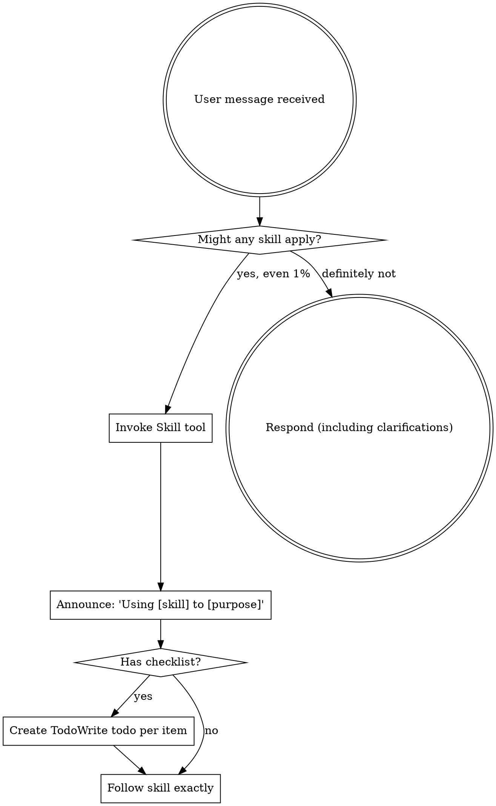

# Using Superpowers

**Source:** OpenClaw → AiDarr GOTCHA Conversion
**Original:** using-superpowers/SKILL.md
**Converted:** 2026-02-11

---

## Description

Use when starting any conversation - establishes how to find and use skills, requiring Skill tool invocation before ANY response including clarifying questions

---

## Goals (Objectives)


<EXTREMELY-IMPORTANT>
If you think there is even a 1% chance a skill might apply to what you are doing, you ABSOLUTELY MUST invoke the skill.

IF A SKILL APPLIES TO YOUR TASK, YOU DO NOT HAVE A CHOICE. YOU MUST USE IT.

This is not negotiable. This is not optional. You cannot rationalize your way out of this.
</EXTREMELY-IMPORTANT>

## How to Access Skills

**In Claude Code:** Use the `Skill` tool. When you invoke a skill, its content is loaded and presented to you—follow it directly. Never use the Read tool on skill files.

**In other environments:** Check your platform's documentation for how skills are loaded.

# Using Skills

## The Rule

**Invoke relevant or requested skills BEFORE any response or action.** Even a 1% chance a skill might apply means that you should invoke the skill to check. If an invoked skill turns out to be wrong for the situation, you don't need to use it.



## Red Flags

These thoughts mean STOP—you're rationalizing:

| Thought | Reality |
|---------|---------|
| "This is just a simple question" | Questions are tasks. Check for skills. |
| "I need more context first" | Skill check comes BEFORE clarifying questions. |
| "Let me explore the codebase first" | Skills tell you HOW to explore. Check first. |
| "I can check git/files quickly" | Files lack conversation context. Check for skills. |
| "Let me gather information first" | Skills tell you HOW to gather information. |
| "This doesn't need a formal skill" | If a skill exists, use it. |
| "I remember this skill" | Skills evolve. Read current version. |
| "This doesn't count as a task" | Action = task. Check for skills. |
| "The skill is overkill" | Simple things become complex. Use it. |
| "I'll just do this one thing first" | Check BEFORE doing anything. |
| "This feels productive" | Undisciplined action wastes time. Skills prevent this. |
| "I know what that means" | Knowing the concept ≠ using the skill. Invoke it. |

## Skill Priority

When multiple skills could apply, use this order:

1. **Process skills first** (brainstorming, debugging) - these determine HOW to approach the task
2. **Implementation skills second** (frontend-design, mcp-builder) - these guide execution

"Let's build X" → brainstorming first, then implementation skills.
"Fix this bug" → debugging first, then domain-specific skills.

## Skill Types

**Rigid** (TDD, debugging): Follow exactly. Don't adapt away discipline.

**Flexible** (patterns): Adapt principles to context.

The skill itself tells you which.

## User Instructions

Instructions say WHAT, not HOW. "Add X" or "Fix Y" doesn't mean skip workflows.


---

## Orchestration

This workflow is designed to be executed by an AI agent with access to relevant tools and context.

**Trigger Conditions:**
- User requests actions matching the description above
- Specific keywords or phrases indicate this workflow is needed
- Context suggests this workflow would provide value

**Execution Steps:**
1. Analyze the user's request against the workflow description
2. Review the Goals section for relevant procedures
3. Apply appropriate tools and context
4. Follow the documented process systematically

---

## Tools

This workflow may require these tool capabilities:

- **File Operations:** Read, write, search files
- **Web Operations:** Fetch, search, browse web content
- **CLI Operations:** Execute commands, run scripts
- **Analysis:** Parse, transform, analyze data

*Note: Specific tools depend on agent capabilities and workflow requirements.*

---

## Context

**Reference Materials:**
- Original OpenClaw skill documentation
- Best practices and patterns from the source
- Related workflows in the AiDarr ecosystem

**Dependencies:**
- May require other workflows for complete functionality
- Check related skills mentioned in original documentation

---

## Hard Prompts

**System Prompt Template:**

```
You are executing the "using-superpowers" workflow from the AiDarr GOTCHA framework.

Your goal: Use when starting any conversation - establishes how to find and use skills, requiring Skill tool invocation before ANY response including clarifying questions

Follow the documented process in the Goals section systematically.
If you encounter ambiguity, refer to the original principles and methodologies.
Always verify completion against the stated success criteria.

Key principles:
- Read all documentation completely before acting
- Follow the documented phases in order
- Verify each step before proceeding
- Document your findings and decisions
```

---

## Args

**Configuration Options:**

```yaml
# Workflow behavior settings
mode: "systematic"  # Options: systematic, quick, thorough
verification: true  # Always verify before completion
documentation: true # Document all steps and findings
parallel: false     # Execute steps sequentially unless specified
```

**Runtime Parameters:**

```yaml
# Adjust based on specific use case
timeout: 300        # Maximum execution time (seconds)
retries: 3          # Retry attempts for transient failures
log_level: "info"   # Options: debug, info, warn, error
```

---

## Metadata

**Conversion Notes:**
- Preserved original content structure
- Added GOTCHA framework sections
- Original OpenClaw patterns maintained
- Ready for AiDarr workflow execution

**Category:** Development Workflow
**Tags:** using_superpowers
